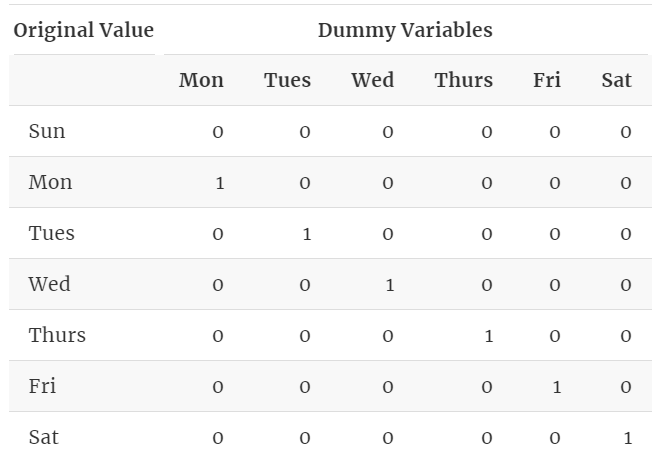
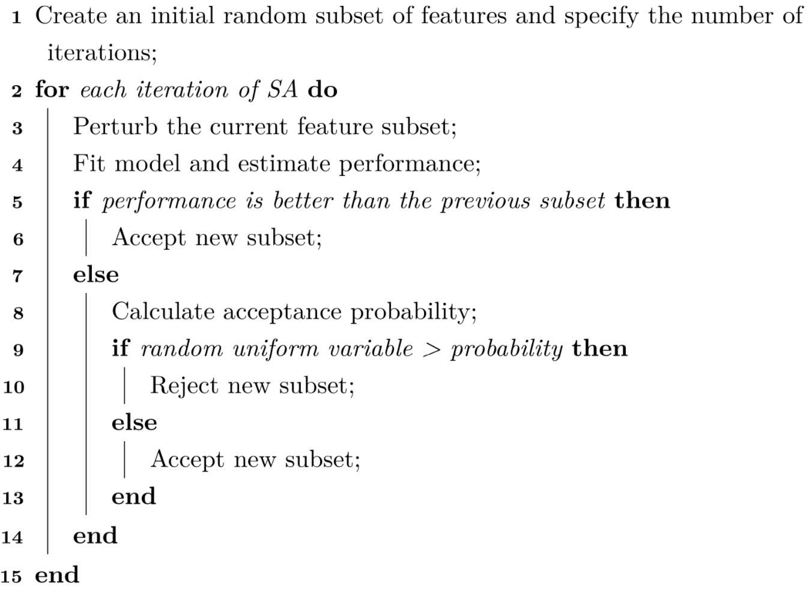

## Exploratory Visualizations
- Scatter Plots
- Pairwise Correlations
- Projection into a lower Dimension
- 1st Level Regression and Classification Trees
- Heatmap or Mosaic Plot for examining associations among Categorical Variables

_(Post model building, visual tools can be used to assess model lack-of-fit and to evaluate the potential effectiveness of new predictors that were not in the original model)_

### Numeric Data
**Histograms & BoxPlots**

# Feature Engineering
> process of creating representations of data that increase the effectiveness of a model

**Overfitting**: model fits very well to the current data but fails when predicting new samples
-  risk of this type of overfitting is especially dangerous when the number of data points (n), is small and the number of potential predictors (p) is very large

**No Free Lunch**: without any specific knowledge of the problem or data at hand, no one predictive model can be said to be the best.

**Model Bias and Variance**:

- Variance: describes the degree in which the values can fluctuate
- Bias: ability of a model to conform to the underlying theoretical structure of the data.
  + Low Bias: one that can be highly flexible and has the capacity to fit a variety of different shapes and patterns
  + High Bias: would be unable to estimate values close to their true theoretical counterparts

## Encoding Categorical Predictors

- Create an "Other" category for rarely occuring predictors
- Feature Hashing: encoding predictors with many categories
- **Supervised Encoding Methods**
  + Effect / Likelihood Encoding: Mean of a certain category

## Engineering Numeric Predictors
- **Potential Problems**
  + Different scales
  + Skewed Distributions
  + Small number of extreme values
  + Complex relationship with the response and is truly predictive but cannot be adequately represented with a simple function or extracted by sophisticated models.
  + Contain relevant and overly redundant information. That is, the information collected could be more effectively and efficiently represented with a smaller, consolidated number of new predictors while still preserving or enhancing the new predictors’ relationship with the response.

### 1:1 Transformations
**BoxCox** _Can only be applied to data that is strictly positive_

**YeoJohnson**: can be used on any numeric data

**Log Transformation**

**Centering and Scaling**

### 1:Many Transformations
**Basis Expansion**:

**Splines**:

**Discretizing**:
- Potential Problems
  + extremely unlikely that the underlying trend is consistent with the new model.
  + when a real trend exists, discretizing the data is most likely making it harder for the model to do an effective job since all of the nuance in the data has been removed.
  + there is probably no objective rationale for a specific cut-point.
  + when there is no relationship between the outcome and the predictor, there is a substantial increase in the probability that an erroneous trend will be “discovered”

### Many:Many Transformations
**Principal Component Analysis**

**Independent Component Analysis**
It creates new components that are linear combinations of the original variables but does so in a way that the components are as statistically independent from one another as possible.
- no unique ordering of the components.

**Non-negative Matrix Factorization**

**Partial Least Squares**
 find linear functions (called latent variables) of the predictors that have optimal covariance with the response. This means that the response guides the dimension reduction such that the scores have the highest possible correlation with the response in the training data.

 **Spatial Sign**

 

## Interaction Effects
> When beginning the search for interactions, expert knowledge about the system will always be most beneficial and can help narrow the search.

> When beginning the search for interactions, expert knowledge about the system will always be most beneficial and can help narrow the search. Then resampling approaches or penalized models can be used to locate the interactions that may usefully improve a model.

> As the number of predictors grows, complete enumeration becomes practically unfeasible. Instead, methods that can readily identify potentially important interactions without searching the entire space should be used. These include two-stage modeling, tree-based methods, and the feasible solution algorithm.

> When the search is complete, the interaction terms that are most likely to improve model performance can be added to a simpler model like linear or logistic regression. The predictive performance can then be estimated through cross-validation and compare to models without these terms to determine the overall predictive improvement.

> **Hierarchy Principal**: the higher the degree of the Interaction, the less likely it will explain variation in the response \
> **Effect Sparsity**: only a fraction of the possible effects truly explain significant amount of response variation \
> **Heredity Principal**: interaction terms may only be considered if the ordered terms preceding the interaction are effective at explaining response variation

### Brute-Force Approach
- **Simple Screening**
- **Penalized Regression**

### Enumeration Practically Impossible
- **Tree-Based Methods**
- **MARS - FDA _(Classification Version)_**
- **Cubist**
- **Feasible Solution Algorithm**

---

# Feature Selection

> - support vector machines and neural networks, are sensitive to irrelevant predictors.
> -  linear or logistic regression are vulnerable to correlated predictors

### Effect of Irrelevant Features

## Intrinsic Methods
feature selection naturally incorporated with the modeling process.
_(i.e. tree-based & rule-based models, MARS, Regularization).
- **Adv**: relatively fast since the selection process is embedded within the model fitting process and provide a direct connection between selecting features and the objective function.
- **DisAdv**: model-dependent

## Filter Methods

conduct an initial supervised analysis of the predictors to determine which are important and then only provide these to the model. Potential Concern: _(a selection of predictors that meets a filtering criteria like statistical significance may not be a set that improves predictive performance)._
- **Adv**: simple and tend to be fast and effective at capturing the large trends _(i.e., individual predictor-outcome relationship)_
- **DisAdv**: prone to over-selecting predictors, a selection of predictors that meets a filtering criteria like statistical significance may not be a set that improves predictive performance7

**Simple Filters**: effective at identifying individual predictors that are associated with the outcome. However, these filters are very susceptible to finding predictors that have strong associations in the available data but do not show any association with new data
  + [Chi-Square | Odds-Ratio | t-test | ROC/Precision-Recall Curves | ANOVA | F-test | Correlation | MIC Values | GAM (p-value)]

## Wrapper Methods
use an external search procedure to choose different subsets of the whole predictor set to evaluate in a model. This approach separates the feature search process from the model fitting process. can take either a **greedy** - **_chooses the search path based on the direction that seems best at the time in order to achieve the best immediate benefit_** or **non-greedy** - **_re-evaluate previous feature combinations and would have the ability to move in a direction that is initially unfavorable if it appears to have a potential benefit after the current step._**

* ### Greedy

* ### Non-Greedy
    + **Naive Bayes Models**: naive aspect of this model is due to a very stringent assumption: the predictors are assumed to be independent. This enables the joint likelihood to be computed as a product of individual class-specific values

    + **Simulated Annealing**:
    

    + **Genetic Algorithm**:
    

## Embedded Methods
feature selection procedure occurs naturally course of the model fitting process. Here an example would be a simple decision tree where variables are selected when the model uses them in a split. If a predictor is never used in a split, the prediction equation is functionally independent of this variable and it has been selected out.
